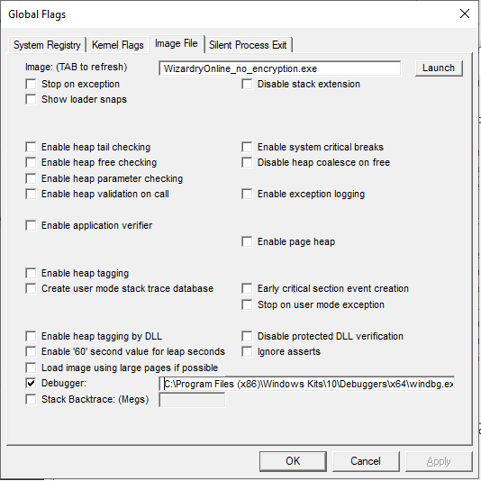

# necromancy-client
Contains all files related to the client.

# Wiki
- Index: https://github.com/necromancyonline/necromancy-server/wiki
- ウィキペディア: https://github.com/necromancyonline/necromancy-server/wiki/%E5%85%A5%E9%96%80

Please check the wiki for additional information.

## Steps for Steam Client
1) Clone this repository ```git clone https://github.com/necromancyonline/necromancy-client.git```
2) Copy the files under `/steam/`-folder into your steam game client folder.

## Settings
https://github.com/necromancyonline/necromancy-client/blob/master/files/steam/save/launcher_option.dat

Contains settings for the game client.

## Login Server IP
https://github.com/necromancyonline/necromancy-client/blob/master/files/steam/data/settings/connection_na.conf

Specifies the Login Server IP where client will coonnect to.

# Debugging the application

## Windows
1. Install Windows SDK. You need to install [Debugging Tools for Windows 10](https://docs.microsoft.com/en-us/windows-hardware/drivers/debugger/debugger-download-tools). You don't need other components of the Windows SDK.
2. After installation complete, go to `C:\Program Files (x86)\Windows Kits\10\Debuggers\x64` and run `gflags.exe`
3. Select Image File tab and populate Image and Debugger fields. Note: the Image should be populated with just filename of the application you want to debug.
Debugger should be full path to debugger - `C:\Program Files (x86)\Windows Kits\10\Debuggers\x64\windbg.exe` in my case.
Image currently would be `WizardryOnline_no_encryption.exe`

Example:



4. When you launch WizardryOnline_no_encryption.exe WinDbg would automatically start and you can debug client. 